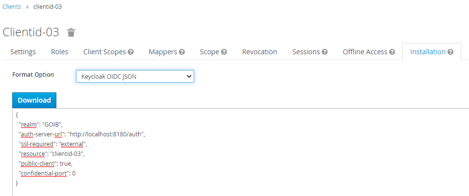

#  Projecte BIOATLES 1.0
*Projecte BIOATLES*

En aquest document s'explica primer com configurar les tecnologies que formen part del projecte Bioatles.
Es recomana la utilització de: 

● OpenJDK11

● JBoss 7.2 EAP

**Descripció**

Bioatles és una eina utilitzada pel Servei de Protecció d'Espècies del Govern de les Illes Balears per a tasques de gestió.

### Ús

- Clonar el repositori:

`git clone https://github.com/Fundacio-Bit/serproes-demo.git`

- Executar des del directori que conté el nostre projecte el següent:

`mvn clean install
`
- Es genera un fitxer "_<project-home>\serproes-demo\serproes-ear\target\serproes-demo.ear_" que s'ha de desplegar l'el 
  jboss.
  
    
- Executar scripts de creació de la base de dades.
  

- Configurar el JBoss per a accedir a la base de dades. Per a això:

    * Descarregar les llibreries des dels webs oficials:descarregar el fitxer postgresql-42.2.5.jar del següent web
      https://jdbc.postgresql.org/download.html.

      NOTA: Es recomana la descàrrega de la versió 42.2.5 que es troba en la taula de Other versions en la columna JDBC 4.2

    * Crear fitxer amb el nom module.xml amb el següent contingut:
      ```
      <module xmlns="urn:jboss:module:1.0" name="org.postgresql">
      <resources>
      <resource-root path="postgresql-42.2.5.jar"/>
      </resources>
      <dependencies>
      <module name="javax.api"/>
      <module name="javax.transaction.api"/>
      </dependencies>
      </module>
      ```
    * Copiar el fitxer **_module.xml_** i **_postgresql-42.2.5.jar_** a la ruta JBOSS_HOME/modules/system/layers/base/org/postgresql/main

    * Afegir la següent configuració dels drivers al fitxer standalone.xml dins JBOSS_HOME/standalone/configuration.

    ```
    <datasources>
          ...
       <drivers>
            <driver name="h2" module="com.h2database.h2">
               <xa-datasource-class>org.h2.jdbcx.JdbcDataSource
               </xa-datasource-class>
            </driver>
            <!-- BIOATLES === drivers === -->
            <driver name="postgresql" module="org.postgresql">
                <xa-datasource-class>org.postgresql.xa.PGXADataSource
                 </xa-datasource-class>
            </driver>
    </datasources>
    ```
    * Reiniciar JBoss, si es trobàs en marxa, i crear els datasources que facin falta afegint-los dins l’etiqueta
      <datasources> de l’standalone.xml:

    ```
    <!-- BIOATLES === datasource === -->
	<datasource jndi-name="java:/SerproesDS" pool-name="SerproesDS">
        <connection-url>jdbc:postgresql://localhost:5432/serproes</connection-url>
        <driver-class>org.postgresql.Driver</driver-class>
        <datasource-class>org.postgresql.ds.PGSimpleDataSource</datasource-class>
        <driver>postgresql</driver>
        <security>
            <user-name>serproes</user-name>
            <password>serproes</password>
        </security>
        <validation>
            <valid-connection-checker class-name="org.jboss.jca.adapters.jdbc.extensions.postgres.PostgreSQLValidConnectionChecker"/>
            <background-validation>true</background-validation>
            <exception-sorter class-name="org.jboss.jca.adapters.jdbc.extensions.postgres.PostgreSQLExceptionSorter"/>
        </validation>
    </datasource>
    ```

 ## Especificacions Tecnològiques

L'aplicació està implementada utilitzant la versió lliure de la plataforma de desenvolupament de Java OpenJDK 11 i 
s'executa sobre un servidor d'aplicacions JBoss EAP 7.2.

La interfície d'usuari està desenvolupada amb ReactJS. 

La persistència de dades funciona sobre una base de dades PostgreSQL 10. L'accés a les dades es durà a terme mitjançant 
la API JPA 1.0.

L'autenticació per a accedir als recursos protegits dels mòduls web es realitza mitjançant un mecanisme d'autenticació 
centralitzat: _RedHat Single Sign-On (Keycloak)_.

Per a la construcció del projecte (compilació i empaquetat) i la gestió de dependències s'utilitza Maven 3.6.

### Seguretat

**<ins>Autenticació en Keycloak desde l'interfaz de usuario ReactJS</ins>**

Hem configurat un client de Keycloak per retornar JWT en iniciar la sessió.

L'usuari s'autentica mitjançant el seu usuari i contrasenya del GOIB. S'accedeix mitjançant una llibreria Javascript 
client-side. Una cosa important que cal destacar sobre l'ús d'aplicacions del client és que el client ha de ser un client 
públic, ja que no hi ha una manera segura d'emmagatzemar les credencials del client en una aplicació del client. Això fa
molt important assegurar-se que els URI de redirecció que heu configurat per al client són correctes i el més específics
possible.

Un cop creat el client feu clic a la pestanya Instal·lació, seleccioneu _**Keycloak JSON OIDC**_ per a l'opció Format i, a 
continuació, feu clic a _Download_.



El fitxer "keycloak.json" descarregat s'ha d'enviar al vostre servidor web a la mateixa ubicació que les pàgines HTML i 
és l'única cosa que es necessita per a fer l'autenticació des del client.

En iniciar sessió retorna un *Bearer Token(JWT)*. Aquest token s'emmagatzema en el sessionStorage i
l'aplicació pot fer sol·licituds als services REST garantits mitjançant la inclusió del token a la capçalera d'autorització.

**<ins>Verificació del JWT(JSON Web Token) des de la API REST</ins>**

La API Rest rep com a capçalera el paràmetre _Authorization_ amb el JWT. 

La llibreria _java-jwt_ (auth0/java-jwt) implementa la verificació del token usant l'algorisme _RSA256(RSA Signature 
amb SHA-256)_. Es tracta d'un algorisme asimètric, cosa que significa que hi ha dues claus: una clau pública i una clau 
privada que s'ha de mantenir en secret. Auth0 té la clau privada utilitzada per generar la signatura, i el consumidor de 
JWT recupera una clau pública dels extrems de metadades proporcionats per Auth0 i l'utilitza per validar la signatura 
JWT. Una vegada verificat es retorna la resposta


## Documentació

Nom | Descripció | Enllaç
------------ | ------------- | -------------
(CAT) Manual Instal.lació.odt | Manual Instal.lació | [Document](./doc/(CAT)%20Manual%20Instal.lació.odt)

* [Keycloak Javascript Adapter](https://github.com/keycloak/keycloak-documentation/blob/master/securing_apps/topics/oidc/javascript-adapter.adoc     )
* [Keycloak connection using a Java application](https://developers.redhat.com/blog/2020/11/24/authentication-and-authorization-using-the-keycloak-rest-api#keycloak_connection_using_a_java_application)
* [auth0/java-jwt](https://github.com/auth0/java-jwt)

## Llicència
[](https://opensource.org/licenses/MIT)
